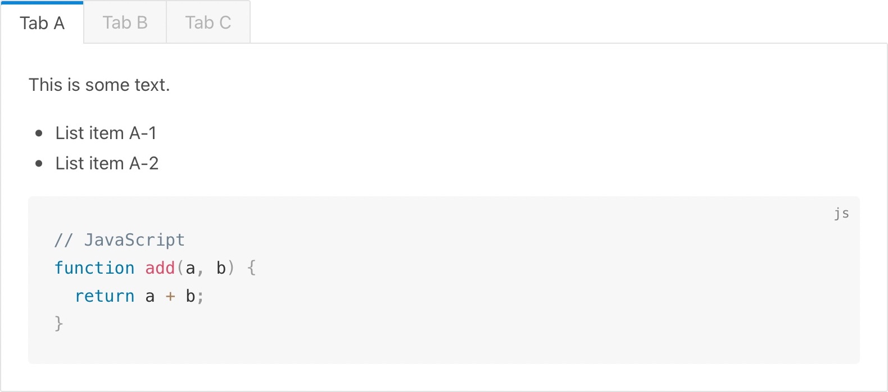

# docsify-tabs

A [docsify.js](https://docsify.js.org) plugin for rendering tabbed content from markdown.

- [Documentation & Demos](https://jhildenbiddle.github.io/docsify-tabs)

  

> 💡 Like this plugin? Check out [docsify-themeable](https://jhildenbiddle.github.io/docsify-themeable) for your site theme, [docsify-plugin-ethicalads](https://jhildenbiddle.github.io/docsify-plugin-ethicalads/) for EthicalAds integration, and [docsify-plugin-runkit](https://jhildenbiddle.github.io/docsify-plugin-runkit/) for live JavaScript REPLs!

## Features

- Generate tabbed content using unobtrusive markup
- Persist tab selections on refresh/revisit
- Sync tab selection for tabs with matching labels
- Nest tab sets within tab sets
- Style tabs using "classic" or "material" tab theme
- Customize styles without complex CSS using CSS custom properties
- Compatible with [docsify-themeable](https://jhildenbiddle.github.io/docsify-themeable/) themes

**Limitations**

- Tabs wraps when their combined width exceeds the content area width

## Installation & Options

See the [documentation site](https://jhildenbiddle.github.io/docsify-tabs) for details.

## Sponsorship

A [sponsorship](https://github.com/sponsors/jhildenbiddle) is more than just a way to show appreciation for the open-source authors and projects we rely on; it can be the spark that ignites the next big idea, the inspiration to create something new, and the motivation to share so that others may benefit.

If you benefit from this project, please consider lending your support and encouraging future efforts by [becoming a sponsor](https://github.com/sponsors/jhildenbiddle).

Thank you! 🙏🏻

## Contact & Support

- Follow 👨🏻‍💻 **@jhildenbiddle** on [Twitter](https://twitter.com/jhildenbiddle) and [GitHub](https://github.com/jhildenbiddle) for announcements
- Create a 💬 [GitHub issue](https://github.com/jhildenbiddle/docsify-tabs/issues) for bug reports, feature requests, or questions
- Add a ⭐️ [star on GitHub](https://github.com/jhildenbiddle/docsify-tabs) and 🐦 [tweet](https://twitter.com/intent/tweet?url=https%3A%2F%2Fgithub.com%2Fjhildenbiddle%2Fdocsify-tabs&hashtags=css,developers,frontend,javascript) to promote the project
- Become a 💖 [sponsor](https://github.com/sponsors/jhildenbiddle) to support the project and future efforts

## License

This project is licensed under the MIT License. See the [LICENSE](https://github.com/jhildenbiddle/docsify-tabs/blob/master/LICENSE) for details.

Copyright (c) John Hildenbiddle ([@jhildenbiddle](https://twitter.com/jhildenbiddle))
